# III. PHÁC HỌA THIẾT KẾ THEO LUỒNG HOẠT ĐỘNG

Phần này viết lại luồng hoạt động theo hướng có thể dùng trực tiếp cho thiết kế giao diện. Thay vì chỉ mô tả chức năng, mỗi nhiệm vụ được tách thành: người sử dụng, mục tiêu, tiền điều kiện, màn hình cần thiết, thao tác của người sử dụng, phản hồi của hệ thống và các trạng thái ngoại lệ. Cách trình bày này giúp người thiết kế UI xác định rõ từng khung màn hình, thành phần điều khiển và trạng thái cần phác họa trong prototype.

## 3.1. Nguyên tắc phác họa chung

Hệ thống được phác họa theo mô hình ứng dụng web nội bộ cho công tác quản trị nhân sự. Các màn hình nghiệp vụ sử dụng cùng một cấu trúc để người sử dụng không phải học lại cách thao tác khi chuyển giữa các module.

| Thành phần | Mô tả thiết kế | Ý nghĩa đối với luồng hoạt động |
|---|---|---|
| Sidebar trái | Hiển thị các module: Hồ sơ nhân sự, Hợp đồng lao động, Cơ cấu tổ chức, Tài khoản và phân quyền, Báo cáo | Cho biết người sử dụng đang ở module nào và có thể chuyển nhanh sang module liên quan |
| Header trên | Chứa breadcrumb, tiêu đề nghiệp vụ, tìm kiếm nhanh và thông tin tài khoản | Giữ ngữ cảnh thao tác, đặc biệt khi người dùng mở dialog hoặc panel phụ |
| Vùng nội dung chính | Hiển thị thẻ thống kê, bộ lọc, bảng dữ liệu, form nhập liệu hoặc wizard | Là nơi thực hiện từng bước của nhiệm vụ |
| Màu sắc trạng thái | Xanh dương cho hành động chính, xanh lá cho thành công, vàng/cam cho cảnh báo, đỏ cho lỗi/nguy hiểm | Giúp người sử dụng nhận biết nhanh trạng thái xử lý và mức độ ưu tiên |
| Phản hồi hệ thống | Toast, cảnh báo inline, empty state, dialog xác nhận, màn hình thành công | Đảm bảo mỗi thao tác đều có kết quả rõ ràng để tiếp tục bước kế tiếp |

Năm nhiệm vụ được chọn để phác họa gồm:

1. Xem và tìm kiếm danh sách hồ sơ nhân sự.
2. Thêm hồ sơ nhân sự.
3. Xem và tìm kiếm danh sách hợp đồng lao động.
4. Thêm hợp đồng lao động.
5. Gia hạn hợp đồng lao động.

## 3.2. Bản đồ màn hình cần thiết

| Mã màn hình | Tên màn hình | Nhiệm vụ liên quan | Thành phần UI cần có |
|---|---|---|---|
| HS-01 | Danh sách hồ sơ nhân sự | Xem/tìm kiếm hồ sơ, bắt đầu thêm hồ sơ | Thẻ thống kê, ô tìm kiếm, bộ lọc nâng cao, bảng hồ sơ, nút Thêm hồ sơ nhân sự |
| HS-02 | Dialog chọn cách thêm hồ sơ | Thêm hồ sơ nhân sự | Menu Thêm thủ công, Nhập từ Excel, hướng dẫn ngắn về mỗi cách |
| HS-03 | Wizard thêm hồ sơ nhân sự | Thêm hồ sơ nhân sự | Stepper 6 bước, form thông tin, nút Tiếp tục, Quay lại, Lưu nháp, Lưu hồ sơ chính thức |
| HS-04 | Màn hình kết quả thêm hồ sơ | Thêm hồ sơ nhân sự | Mã viên chức được tạo, trạng thái hồ sơ, hành động xem hồ sơ hoặc thêm tiếp |
| HĐ-01 | Danh sách hợp đồng lao động | Xem/tìm kiếm hợp đồng, bắt đầu tạo/gia hạn | Thẻ thống kê, cảnh báo sắp hết hạn, bộ lọc, bảng hợp đồng, nút Tạo hợp đồng |
| HĐ-02 | Dialog tạo hợp đồng | Thêm hợp đồng lao động | Form chọn nhân sự, loại hợp đồng, ngày ký, ngày hiệu lực, lương, đơn vị, tệp PDF |
| HĐ-03 | Dialog gia hạn hợp đồng | Gia hạn hợp đồng lao động | Thông tin hợp đồng cũ, gợi ý hợp đồng mới, ngày bắt đầu/kết thúc, tệp quyết định, cảnh báo |
| HĐ-04 | Trạng thái lỗi/xác nhận hợp đồng | Thêm/gia hạn hợp đồng | Lỗi trùng thời gian, quá số lần ký, thiếu tệp, dialog xác nhận, toast thành công |

## 3.3. Luồng 1 - Xem và tìm kiếm danh sách hồ sơ nhân sự

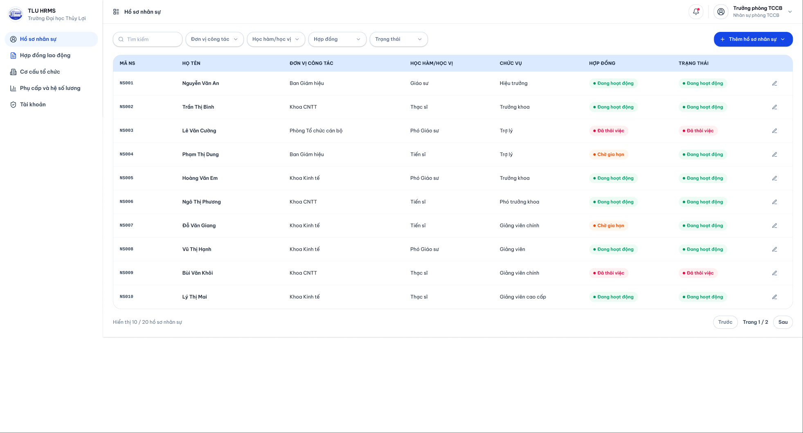

| Thuộc tính | Nội dung |
|---|---|
| Người sử dụng chính | Phòng TCCB; Phòng TCKT có thể xem và tìm kiếm để đối chiếu thông tin |
| Mục tiêu | Tìm đúng hồ sơ nhân sự theo từ khóa hoặc bộ lọc nghiệp vụ trong thời gian ngắn |
| Tiền điều kiện | Người sử dụng đã đăng nhập và có quyền truy cập module Hồ sơ nhân sự |
| Điểm bắt đầu | Sidebar > Hồ sơ nhân sự |
| Kết quả mong đợi | Danh sách hiển thị đúng các hồ sơ phù hợp; người sử dụng có thể mở chi tiết, sửa hồ sơ hoặc bắt đầu thêm mới |

| Bước | Màn hình/trạng thái | Thao tác của người sử dụng | Phản hồi của hệ thống | Gợi ý thiết kế UI |
|---|---|---|---|---|
| 1 | HS-01 - Danh sách mặc định | Mở module Hồ sơ nhân sự | Hiển thị tổng số hồ sơ, số đang làm việc, số sắp hết hợp đồng và bảng dữ liệu mới nhất | Cần có breadcrumb và tiêu đề rõ ràng để người dùng biết đang ở danh sách hồ sơ |
| 2 | HS-01 - Tìm kiếm nhanh | Nhập tên, mã viên chức, CCCD, email hoặc số điện thoại vào ô tìm kiếm | Danh sách cập nhật theo từ khóa; phần trùng khớp nên được làm nổi bật | Ô tìm kiếm đặt trên bộ lọc, có placeholder nêu rõ loại dữ liệu có thể nhập |
| 3 | HS-01 - Bộ lọc nâng cao | Chọn đơn vị, học hàm/học vị, vai trò trong đơn vị, trạng thái làm việc, trạng thái hợp đồng hoặc giới tính | Bảng dữ liệu chỉ hiển thị các hồ sơ thỏa điều kiện | Bộ lọc nên đặt trong panel/dropdown, có chip tóm tắt bộ lọc đang áp dụng |
| 4 | HS-01 - Kết quả rỗng | Từ khóa hoặc bộ lọc không có kết quả | Hiển thị empty state kèm gợi ý xóa bộ lọc hoặc thêm hồ sơ mới | Empty state cần có thông điệp rõ: Không tìm thấy hồ sơ phù hợp |
| 5 | HS-01 - Chọn bản ghi | Bấm vào dòng hồ sơ hoặc nút Xem | Mở chi tiết hồ sơ/panel thông tin để tiếp tục xem hoặc chỉnh sửa | Dòng dữ liệu cần có hover state và hành động rõ ràng |

Ngoại lệ cần thiết kế:

- Nếu người sử dụng không có quyền xem một nhóm hồ sơ, hệ thống không hiển thị dữ liệu ngoài phạm vi quyền.
- Nếu hệ thống đang tải dữ liệu, bảng cần có loading skeleton để tránh hiểu nhầm là không có dữ liệu.
- Nếu bộ lọc có quá nhiều điều kiện, giao diện cần có nút Xóa bộ lọc để quay về danh sách ban đầu.

## 3.4. Luồng 2 - Thêm hồ sơ nhân sự

| Thuộc tính | Nội dung |
|---|---|
| Người sử dụng chính | Phòng TCCB |
| Mục tiêu | Tạo hồ sơ nhân sự mới và sinh mã viên chức chính thức sau khi dữ liệu hợp lệ |
| Tiền điều kiện | Người sử dụng đã đăng nhập; có quyền thêm hồ sơ; nhân sự chưa tồn tại trong hệ thống |
| Điểm bắt đầu | HS-01 > nút Thêm hồ sơ nhân sự |
| Kết quả mong đợi | Hệ thống tạo hồ sơ mới, gán mã viên chức, trạng thái hợp đồng ban đầu là Chưa hợp đồng và trạng thái xét duyệt là Đang chờ xét |

| Bước | Màn hình/trạng thái | Thao tác của người sử dụng | Phản hồi của hệ thống | Gợi ý thiết kế UI |
|---|---|---|---|---|
| 1 | HS-02 - Chọn cách thêm | Bấm nút Thêm hồ sơ nhân sự | Hiển thị menu gồm Thêm thủ công và Nhập từ Excel | Menu cần đặt gần nút chính, mô tả ngắn ưu điểm của từng cách |
| 2 | HS-03 - Bước 1: Thông tin định danh | Chọn Thêm thủ công, nhập họ tên, ngày sinh, giới tính, CCCD, ngày cấp, nơi cấp | Kiểm tra trường bắt buộc và cảnh báo nếu CCCD đã tồn tại | Cần có validate inline ngay tại trường lỗi, không đợi đến cuối wizard |
| 3 | HS-03 - Bước 2: Liên hệ và quốc tịch | Nhập địa chỉ, email, số điện thoại, quốc tịch; nếu là người nước ngoài thì nhập hộ chiếu/thị thực/giấy phép lao động | Hiển thị thêm nhóm trường cho nhân sự nước ngoài khi bật toggle tương ứng | Toggle người nước ngoài cần làm thay đổi form một cách dễ nhận biết |
| 4 | HS-03 - Bước 3: Công tác và lương | Chọn đơn vị, vị trí, chức danh, loại nhân sự, ngày bắt đầu, bậc/hệ số lương | Hệ thống gán người dùng vào đơn vị được chọn và kiểm tra ngày bắt đầu hợp lệ | Nên có cây đơn vị hoặc combobox có tìm kiếm để chọn đơn vị |
| 5 | HS-03 - Bước 4: Trình độ/đào tạo | Nhập học hàm, học vị, chuyên môn, quá trình đào tạo | Lưu tạm dữ liệu và cập nhật tiến độ wizard | Stepper cần cho biết bước đã hoàn thành, bước đang làm và bước còn thiếu |
| 6 | HS-03 - Bước 5: Tài liệu | Tải lên CCCD, sơ yếu lý lịch, bằng cấp và quyết định tuyển dụng | Hiển thị trạng thái đã tải/chưa tải của từng tài liệu; cảnh báo tài liệu bắt buộc còn thiếu | Danh sách tài liệu nên có badge Bắt buộc/Tùy chọn |
| 7 | HS-03 - Bước 6: Xem lại và xác nhận | Kiểm tra thông tin tổng hợp, bấm Lưu hồ sơ chính thức | Hệ thống tạo mã viên chức và lưu hồ sơ | Nút Lưu hồ sơ chính thức chỉ nên bật khi các trường bắt buộc hợp lệ |
| 8 | HS-04 - Thành công | Chọn Xem hồ sơ vừa tạo hoặc Thêm hồ sơ khác | Điều hướng về chi tiết hồ sơ hoặc reset wizard | Màn hình thành công cần hiển thị mã viên chức để người dùng đối chiếu |

Nhánh thay thế - Nhập từ Excel:

| Bước | Thao tác | Phản hồi hệ thống | Trạng thái UI cần có |
|---|---|---|---|
| 1 | Chọn Nhập từ Excel | Hiển thị màn hình tải file mẫu và upload file | Khu vực kéo thả file, nút Tải file mẫu |
| 2 | Tải file Excel | Hệ thống đọc file và kiểm tra cột/dữ liệu | Loading state trong lúc kiểm tra |
| 3 | Xem kết quả kiểm tra | Hiển thị số dòng hợp lệ, số dòng lỗi, danh sách lỗi | Bảng lỗi có cột dòng, trường lỗi, nội dung lỗi |
| 4 | Chọn nhập toàn bộ hoặc nhập các dòng hợp lệ | Tạo hồ sơ cho các dòng hợp lệ; cho phép tải file lỗi | Success summary và nút Tải danh sách lỗi |

Ngoại lệ cần thiết kế:

- CCCD, email hoặc số điện thoại trùng với hồ sơ đã có: hiển thị cảnh báo và chặn lưu chính thức.
- Thiếu trường bắt buộc: hiển thị lỗi inline, đánh dấu bước chưa hợp lệ trên stepper.
- Người sử dụng đóng wizard khi đang nhập: hiển thị dialog hỏi Lưu nháp hay Hủy thay đổi.
- File Excel sai cấu trúc: hiển thị thông báo lỗi file và liên kết tải file mẫu đúng.

## 3.5. Luồng 3 - Xem và tìm kiếm danh sách hợp đồng lao động

| Thuộc tính | Nội dung |
|---|---|
| Người sử dụng chính | Phòng TCCB |
| Mục tiêu | Theo dõi toàn bộ hợp đồng, phát hiện hợp đồng sắp hết hạn và chọn hợp đồng cần xử lý |
| Tiền điều kiện | Người sử dụng đã đăng nhập và có quyền xem module Hợp đồng lao động |
| Điểm bắt đầu | Sidebar > Hợp đồng lao động |
| Kết quả mong đợi | Danh sách hợp đồng được lọc đúng theo nhu cầu; hợp đồng sắp hết hạn được nhận diện nhanh để gia hạn |

| Bước | Màn hình/trạng thái | Thao tác của người sử dụng | Phản hồi của hệ thống | Gợi ý thiết kế UI |
|---|---|---|---|---|
| 1 | HĐ-01 - Dashboard hợp đồng | Mở module Hợp đồng lao động | Hiển thị thẻ thống kê tổng hợp và bảng hợp đồng | Các thẻ thống kê nên đặt trước bộ lọc để tạo tổng quan nhanh |
| 2 | HĐ-01 - Cảnh báo sắp hết hạn | Quan sát banner cảnh báo hợp đồng sắp hết hạn trong 30 ngày | Hiển thị số lượng hợp đồng cần xử lý và nút lọc nhanh | Banner màu vàng/cam, nội dung ngắn gọn và có hành động Lọc ngay |
| 3 | HĐ-01 - Tìm kiếm/bộ lọc | Nhập tên/mã nhân sự/số hợp đồng; chọn loại hợp đồng, trạng thái, khoảng ngày, đơn vị | Bảng hợp đồng cập nhật theo điều kiện | Bộ lọc cần giữ trạng thái đã chọn khi người dùng mở dialog xử lý rồi quay lại |
| 4 | HĐ-01 - Bảng hợp đồng | Sắp xếp theo ngày hết hạn hoặc trạng thái | Hợp đồng sắp hết hạn nằm ở vị trí dễ thấy, badge trạng thái được cập nhật | Cột Ngày hết hạn và Trạng thái cần dễ quét bằng mắt |
| 5 | HĐ-01 - Chọn hành động | Bấm Xem, Gia hạn hoặc Tạo hợp đồng | Mở màn hình/dialog tương ứng | Hành động nguy hiểm hoặc có điều kiện cần được vô hiệu hóa khi không hợp lệ |

Ngoại lệ cần thiết kế:

- Không có hợp đồng phù hợp bộ lọc: hiển thị empty state và nút xóa bộ lọc.
- Hợp đồng đã hết hiệu lực: không hiển thị hành động Gia hạn trực tiếp nếu quy định nghiệp vụ không cho phép.
- Dữ liệu đang tải: bảng hợp đồng hiển thị skeleton/loading và không cho thao tác dòng.

## 3.6. Luồng 4 - Thêm hợp đồng lao động

| Thuộc tính | Nội dung |
|---|---|
| Người sử dụng chính | Phòng TCCB |
| Mục tiêu | Tạo hợp đồng lao động mới cho một nhân sự đã có hồ sơ trong hệ thống |
| Tiền điều kiện | Hồ sơ nhân sự đã tồn tại; nhân sự đủ điều kiện ký hợp đồng; người sử dụng có tệp hợp đồng PDF/quyết định liên quan |
| Điểm bắt đầu | HĐ-01 > nút Tạo hợp đồng |
| Kết quả mong đợi | Hợp đồng mới được tạo, có trạng thái phù hợp và cập nhật trạng thái hợp đồng của hồ sơ nhân sự |

| Bước | Màn hình/trạng thái | Thao tác của người sử dụng | Phản hồi của hệ thống | Gợi ý thiết kế UI |
|---|---|---|---|---|
| 1 | HĐ-02 - Mở dialog tạo hợp đồng | Bấm Tạo hợp đồng | Hiển thị form tạo hợp đồng ở dạng dialog lớn hoặc side panel | Nên giữ nền danh sách hợp đồng phía sau để người dùng không mất ngữ cảnh |
| 2 | HĐ-02 - Chọn nhân sự | Tìm và chọn nhân sự theo mã viên chức/họ tên | Hệ thống hiển thị thông tin tóm tắt, đơn vị, trạng thái hợp đồng hiện tại | Ô chọn nhân sự nên có autocomplete và card tóm tắt sau khi chọn |
| 3 | HĐ-02 - Kiểm tra điều kiện | Hệ thống kiểm tra nhân sự có đủ điều kiện tạo hợp đồng hay không | Nếu không hợp lệ, hiển thị lỗi và không cho tiếp tục | Lỗi cần nói rõ lý do: đang có hợp đồng hiệu lực, quá số lần ký, chưa đủ thông tin |
| 4 | HĐ-02 - Nhập thông tin hợp đồng | Chọn loại hợp đồng, ngày ký, ngày hiệu lực, ngày hết hạn, mức lương, đơn vị | Hệ thống kiểm tra ngày hợp lệ và cảnh báo nếu trùng/khoảng thời gian bị chồng lấn | Trường ngày nên có ràng buộc min/max và thông báo lỗi inline |
| 5 | HĐ-02 - Tải tệp hợp đồng | Tải lên bản PDF/quyết định | Hiển thị tên tệp, dung lượng, trạng thái tải lên | Vùng upload cần chấp nhận kéo thả và có nút xóa/thay tệp |
| 6 | HĐ-02 - Xác nhận tạo | Bấm Tạo hợp đồng | Hệ thống lưu hợp đồng, cập nhật bảng và hiển thị toast thành công | Sau khi tạo xong nên đóng dialog và đưa hợp đồng mới lên đầu danh sách |

Ngoại lệ cần thiết kế:

- Chưa chọn nhân sự: hiển thị lỗi tại trường chọn nhân sự.
- Nhân sự đã có hợp đồng còn hiệu lực ngoài cửa sổ gia hạn: chặn tạo mới và gợi ý dùng chức năng gia hạn nếu phù hợp.
- Ngày bắt đầu lớn hơn ngày kết thúc hoặc bị trùng với hợp đồng cũ: hiển thị lỗi inline và không cho lưu.
- Quá số lần ký hợp đồng theo quy định: hiển thị cảnh báo nghiệp vụ, không chỉ hiển thị lỗi kỹ thuật.
- Thiếu tệp PDF/quyết định: không cho tạo hợp đồng chính thức.

## 3.7. Luồng 5 - Gia hạn hợp đồng lao động

| Thuộc tính | Nội dung |
|---|---|
| Người sử dụng chính | Phòng TCCB |
| Mục tiêu | Tạo hợp đồng kế tiếp cho nhân sự có hợp đồng sắp hết hạn mà không phải nhập lại toàn bộ dữ liệu từ đầu |
| Tiền điều kiện | Hợp đồng hiện tại còn hiệu lực hoặc đang trong khoảng cần gia hạn; người sử dụng có quyền gia hạn |
| Điểm bắt đầu | HĐ-01 > lọc Sắp hết hạn > hành động Gia hạn trên dòng hợp đồng |
| Kết quả mong đợi | Hợp đồng mới được tạo liên tiếp với hợp đồng cũ; hợp đồng cũ được cập nhật trạng thái nếu cần |

| Bước | Màn hình/trạng thái | Thao tác của người sử dụng | Phản hồi của hệ thống | Gợi ý thiết kế UI |
|---|---|---|---|---|
| 1 | HĐ-01 - Lọc sắp hết hạn | Bấm banner cảnh báo hoặc chọn trạng thái Sắp hết hạn | Danh sách chỉ hiển thị các hợp đồng trong khoảng cần gia hạn | Nên có chip Sắp hết hạn để người dùng biết đang lọc |
| 2 | HĐ-01 - Chọn hợp đồng | Bấm Gia hạn trên dòng hợp đồng | Hệ thống mở dialog gia hạn và truyền thông tin hợp đồng cũ | Nút Gia hạn chỉ hiển thị/enable với hợp đồng đủ điều kiện |
| 3 | HĐ-03 - Kiểm tra hợp đồng cũ | Xem thông tin hợp đồng hiện tại, số lần đã ký, ngày hết hạn, loại hợp đồng | Hệ thống cảnh báo nếu hợp đồng không nằm trong khoảng gia hạn hoặc đã quá số lần ký | Thông tin hợp đồng cũ nên nằm ở card bên trên form mới |
| 4 | HĐ-03 - Nhập thông tin gia hạn | Chọn loại hợp đồng mới, ngày bắt đầu, ngày kết thúc, mức lương/đơn vị nếu thay đổi | Hệ thống gợi ý ngày bắt đầu liên tiếp sau ngày hết hạn cũ và kiểm tra chồng lấn | Trường ngày bắt đầu có thể được điền sẵn để giảm lỗi nhập liệu |
| 5 | HĐ-03 - Tải quyết định/tệp hợp đồng | Tải tệp PDF hợp đồng mới hoặc quyết định gia hạn | Hiển thị trạng thái tệp đã tải và cho phép thay tệp | Tệp bắt buộc cần có ký hiệu rõ trong form |
| 6 | HĐ-03 - Xác nhận gia hạn | Bấm Xác nhận gia hạn | Hệ thống tạo hợp đồng mới, cập nhật danh sách, hiển thị toast thành công | Sau khi thành công nên đưa người dùng về danh sách Sắp hết hạn đã cập nhật |

Ngoại lệ cần thiết kế:

- Hợp đồng không còn trong thời gian được gia hạn: hiển thị cảnh báo và vô hiệu hóa nút xác nhận.
- Ngày bắt đầu hợp đồng mới không liên tiếp hoặc bị chồng với hợp đồng cũ: hiển thị lỗi tại trường ngày.
- Đã đạt giới hạn số lần ký: hiển thị thông báo nghiệp vụ và gợi ý chuyển sang loại hợp đồng phù hợp nếu có.
- Người sử dụng hủy thao tác khi đã nhập thông tin: hiển thị dialog xác nhận rồi mới đóng.

# IV. XÂY DỰNG STORYBOARD

Phân cảnh theo các kịch bản (scenario storyboards) được trình bày dưới hình thức “story - câu chuyện”. Mỗi kịch bản mô tả một tình huống sử dụng thực tế của người dùng, kèm theo các phác họa giao diện tại những thời điểm quan trọng. Cách trình bày này giúp nhóm thiết kế nhìn được diễn tiến từ lúc người dùng bắt đầu nhiệm vụ, tương tác với các cửa sổ/hộp thoại, nhận phản hồi của hệ thống và hoàn tất công việc.

## 4.1. Kịch bản 1 - Xem và tìm kiếm danh sách hồ sơ nhân sự

**Câu chuyện sử dụng:** Một chuyên viên Phòng TCCB cần tìm nhanh hồ sơ của một cán bộ để kiểm tra thông tin công tác. Chuyên viên không muốn mở từng hồ sơ riêng lẻ, mà cần một màn hình danh sách có thể tìm theo tên, mã viên chức, CCCD hoặc lọc theo đơn vị, trạng thái làm việc và trạng thái hợp đồng.

Khi bắt đầu, chuyên viên chọn module **Hồ sơ nhân sự** ở cây thực đơn bên trái. Giao diện hiển thị màn hình danh sách hồ sơ với vùng thống kê tổng quan ở phía trên, bên dưới là ô tìm kiếm, bộ lọc và bảng dữ liệu. Ở thời điểm này, người sử dụng cần nhìn thấy ngay mình đang ở module nào, tổng số hồ sơ hiện có và các thao tác chính có thể thực hiện.

Sau đó, chuyên viên nhập từ khóa vào ô tìm kiếm hoặc mở bộ lọc nâng cao. Giao diện cần thể hiện rõ các trường lọc như đơn vị, học hàm/học vị, vai trò trong đơn vị, trạng thái làm việc, trạng thái hợp đồng và giới tính. Các bộ lọc đã chọn nên được giữ lại trên màn hình để người dùng biết danh sách đang được thu hẹp theo điều kiện nào.

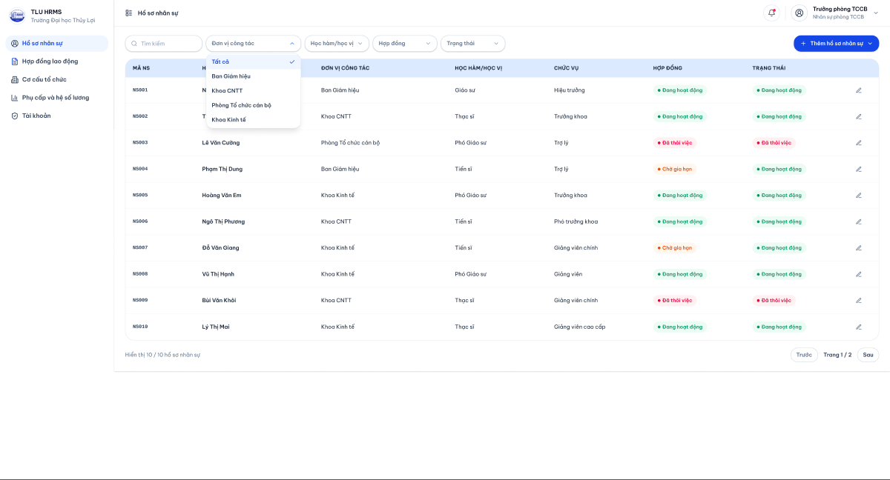

Khi người sử dụng áp dụng điều kiện tìm kiếm, hệ thống cập nhật bảng hồ sơ. Những hồ sơ phù hợp được hiển thị trong bảng; nếu không có kết quả, giao diện cần có thông báo rỗng và nút xóa bộ lọc để quay lại danh sách ban đầu. Đây là điểm quan trọng trong storyboard vì nó cho thấy hệ thống phản hồi trực tiếp với thao tác tìm kiếm.

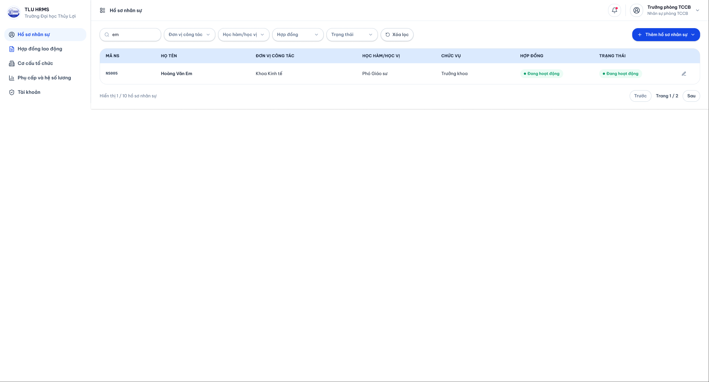

Khi đã tìm được hồ sơ cần xem, chuyên viên chọn một dòng trong bảng để mở chi tiết hoặc chuyển sang thao tác thêm hồ sơ mới. Giao diện cần thể hiện trạng thái hover/selected của dòng dữ liệu và các nút hành động rõ ràng để người sử dụng biết bước tiếp theo có thể làm gì.

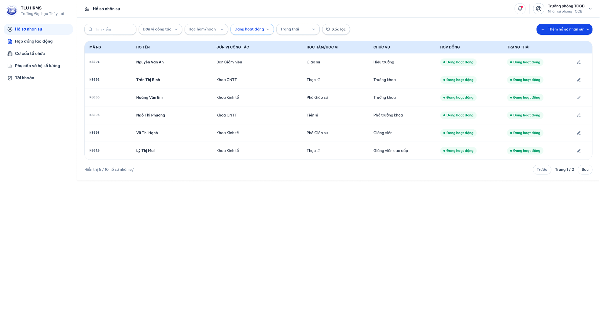

## 4.2. Kịch bản 2 - Thêm hồ sơ nhân sự

**Câu chuyện sử dụng:** Một nhân sự mới vừa được tuyển dụng, chuyên viên Phòng TCCB cần tạo hồ sơ ban đầu cho người này trong hệ thống. Nhiệm vụ yêu cầu nhập nhiều nhóm thông tin nên giao diện cần chia thành các bước nhỏ, tránh để người dùng điền một biểu mẫu quá dài.

Từ màn hình danh sách hồ sơ, chuyên viên bấm nút **Thêm hồ sơ nhân sự**. Hệ thống không đưa người dùng rời khỏi ngữ cảnh danh sách ngay lập tức mà mở một hộp chọn cách thêm hồ sơ. Tại đây có hai lựa chọn: **Thêm thủ công** cho một hồ sơ riêng lẻ và **Nhập từ Excel** cho trường hợp thêm nhiều hồ sơ cùng lúc.

Trong kịch bản mẫu, chuyên viên chọn **Thêm thủ công**. Hệ thống mở wizard thêm hồ sơ với các bước được hiển thị ở đầu hộp thoại. Ở bước đầu tiên, người dùng nhập thông tin định danh như họ tên, ngày sinh, giới tính, CCCD, ngày cấp và nơi cấp. Nếu CCCD đã tồn tại hoặc thiếu thông tin bắt buộc, lỗi cần xuất hiện ngay tại trường nhập để người dùng sửa tại chỗ.

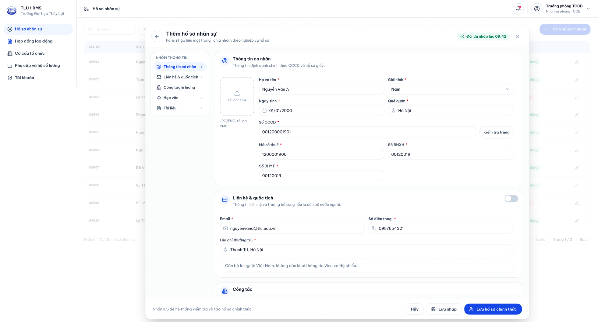

Sau khi thông tin định danh hợp lệ, chuyên viên chuyển sang nhóm thông tin công tác và lương. Giao diện cần có trường chọn đơn vị, vị trí công tác, loại nhân sự, ngày bắt đầu làm việc và các thông tin lương cơ bản. Với trường đơn vị, nên dùng cây đơn vị hoặc ô chọn có tìm kiếm để phù hợp với cơ cấu tổ chức nhiều cấp.

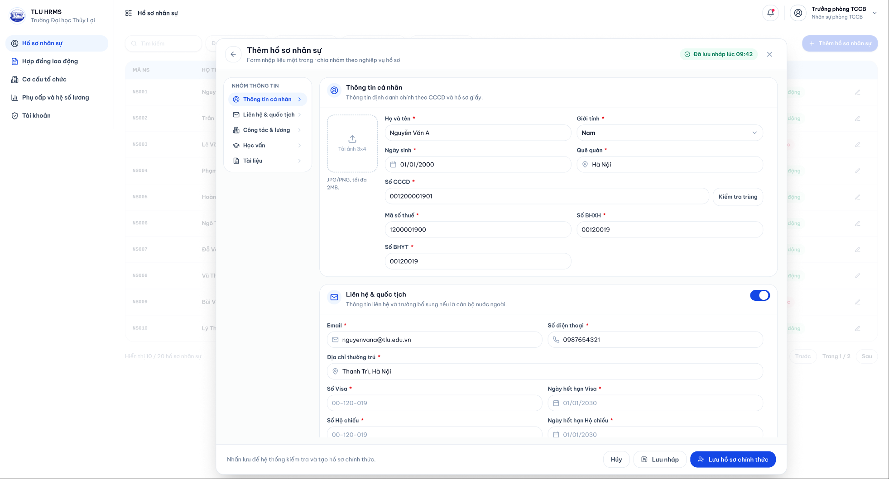

Ở bước tài liệu, chuyên viên tải lên các giấy tờ như CCCD, sơ yếu lý lịch, bằng cấp và quyết định tuyển dụng. Nếu chưa đủ tài liệu hoặc chưa có đủ dữ liệu để lưu chính thức, người dùng có thể chọn **Lưu nháp**. Hệ thống cần hiển thị rõ tài liệu nào đã có, tài liệu nào còn thiếu và thông báo bản nháp đã được lưu.

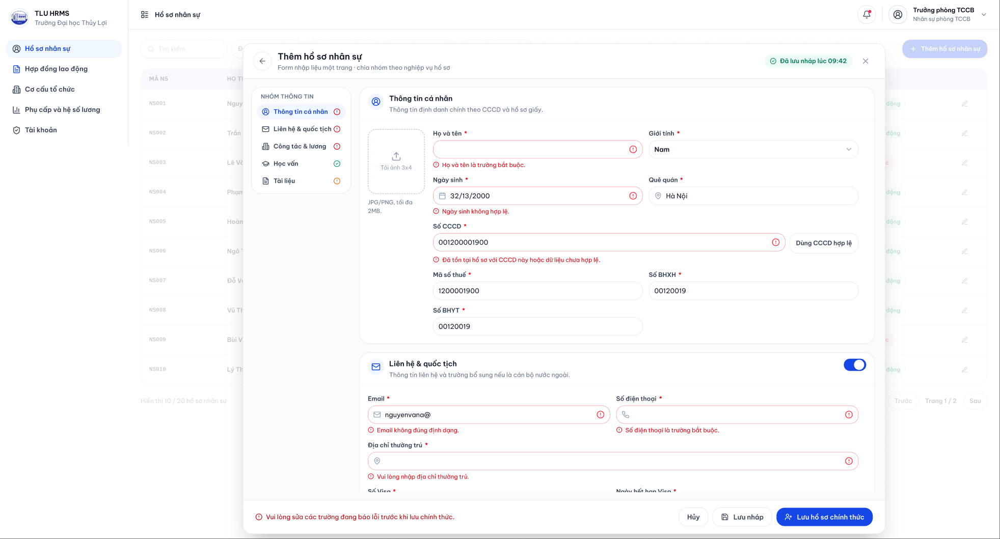

Khi mọi thông tin bắt buộc đã hoàn thành, chuyên viên đến bước **Xem lại và xác nhận**. Màn hình này đóng vai trò như bản tổng hợp cuối cùng để kiểm tra trước khi lưu. Sau khi bấm **Lưu hồ sơ chính thức**, hệ thống tạo mã viên chức, lưu hồ sơ mới và hiển thị thông báo thành công để người dùng có thể mở hồ sơ vừa tạo hoặc tiếp tục thêm hồ sơ khác.

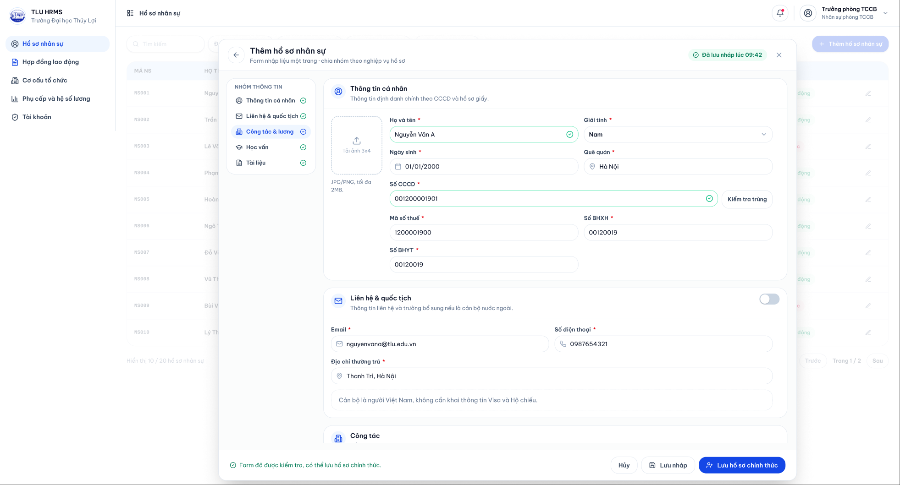

## 4.3. Kịch bản 3 - Xem và tìm kiếm danh sách hợp đồng lao động

**Câu chuyện sử dụng:** Đến kỳ rà soát hợp đồng, chuyên viên Phòng TCCB cần xem toàn bộ hợp đồng lao động, đặc biệt là các hợp đồng sắp hết hạn để chuẩn bị gia hạn hoặc xử lý nghiệp vụ liên quan.

Chuyên viên chọn module **Hợp đồng lao động** trên sidebar. Giao diện mở ra màn hình danh sách hợp đồng với các thẻ thống kê ở đầu trang, bộ lọc và bảng hợp đồng bên dưới. Các thông tin như tổng số hợp đồng, hợp đồng còn hiệu lực, hợp đồng sắp hết hạn và hợp đồng hết hiệu lực cần được đặt ở vị trí dễ quan sát.

Ngay khi vào màn hình, hệ thống hiển thị cảnh báo về các hợp đồng sắp hết hạn trong 30 ngày. Đây là điểm nhấn của storyboard vì người dùng không cần tự lọc thủ công mới biết có vấn đề cần xử lý. Banner cảnh báo nên có màu vàng/cam và có hành động nhanh như **Lọc ngay**.

Khi cần tìm một hợp đồng cụ thể, chuyên viên nhập từ khóa hoặc chọn các điều kiện như loại hợp đồng, trạng thái, khoảng ngày và đơn vị. Hệ thống cập nhật bảng hợp đồng tương ứng, đồng thời hiển thị các điều kiện lọc đang áp dụng để người dùng có thể điều chỉnh hoặc xóa nhanh.

Sau khi tìm được hợp đồng cần xử lý, chuyên viên chọn thao tác phù hợp trên dòng dữ liệu, ví dụ xem chi tiết, gia hạn hoặc tạo hợp đồng mới. Giao diện cần làm rõ thao tác nào khả dụng với từng trạng thái hợp đồng để tránh người dùng chọn nhầm hành động.

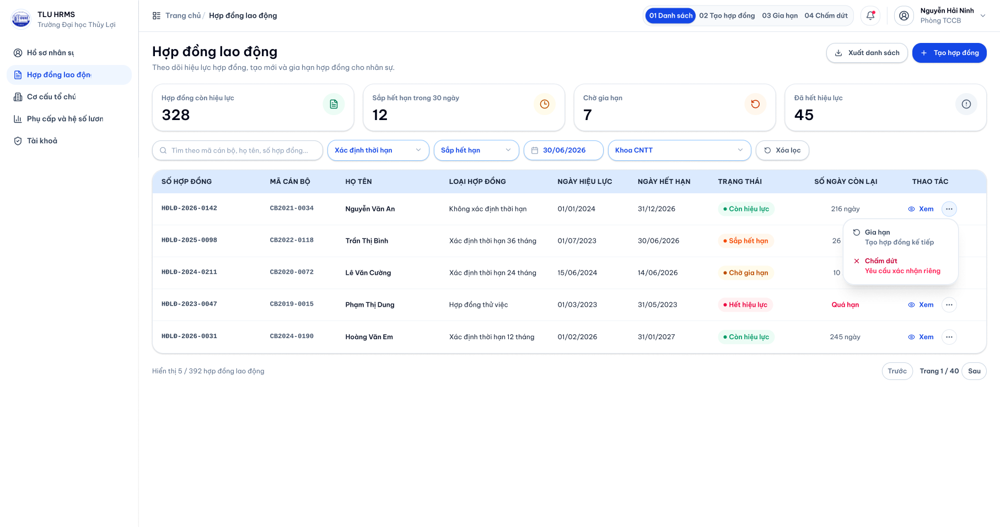

## 4.4. Kịch bản 4 - Thêm hợp đồng lao động

**Câu chuyện sử dụng:** Sau khi hồ sơ nhân sự đã được tạo, chuyên viên Phòng TCCB cần lập hợp đồng lao động cho nhân sự đó. Công việc này yêu cầu liên kết hợp đồng với đúng hồ sơ, nhập các mốc thời gian hợp lệ và đính kèm tệp hợp đồng/quyết định.

Từ màn hình danh sách hợp đồng, chuyên viên bấm **Tạo hợp đồng**. Hệ thống mở hộp thoại tạo hợp đồng ở phía trên màn hình hiện tại. Việc dùng hộp thoại giúp người dùng vẫn giữ được bối cảnh danh sách hợp đồng phía sau và có thể quay lại nếu hủy thao tác.

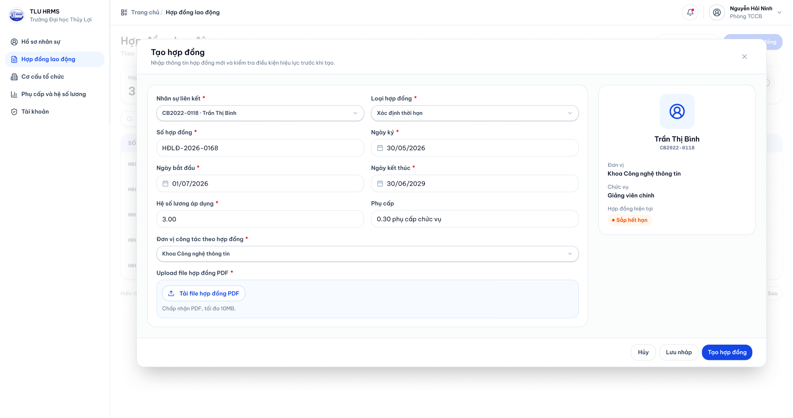

Ở bước đầu tiên trong hộp thoại, chuyên viên tìm và chọn nhân sự cần lập hợp đồng. Sau khi chọn, hệ thống hiển thị thẻ tóm tắt gồm mã viên chức, họ tên, đơn vị và trạng thái hợp đồng hiện tại. Nếu nhân sự chưa đủ điều kiện ký hợp đồng hoặc đang có hợp đồng còn hiệu lực ngoài cửa sổ gia hạn, hệ thống cần cảnh báo ngay tại bước này.

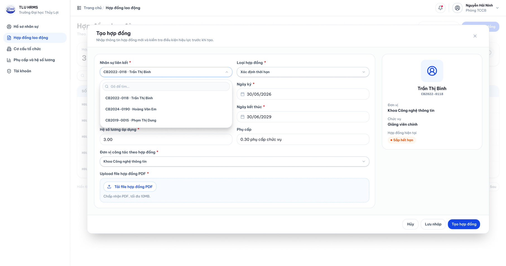

Khi nhân sự hợp lệ, chuyên viên nhập thông tin hợp đồng gồm loại hợp đồng, ngày ký, ngày hiệu lực, ngày hết hạn, mức lương, đơn vị và tải lên tệp PDF. Giao diện cần tách rõ nhóm thông tin hành chính, nhóm thời hạn và nhóm tệp đính kèm để người dùng không bỏ sót dữ liệu.

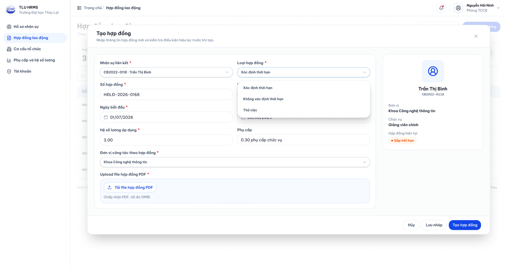

Trước khi lưu, hệ thống kiểm tra các lỗi nghiệp vụ như ngày hiệu lực lớn hơn ngày hết hạn, khoảng thời gian bị chồng với hợp đồng cũ, vượt quá số lần ký hoặc thiếu tệp bắt buộc. Nếu có lỗi, thông báo cần xuất hiện ngay trong hộp thoại; nếu hợp lệ, hệ thống lưu hợp đồng mới, đóng hộp thoại và cập nhật hợp đồng vừa tạo vào danh sách.

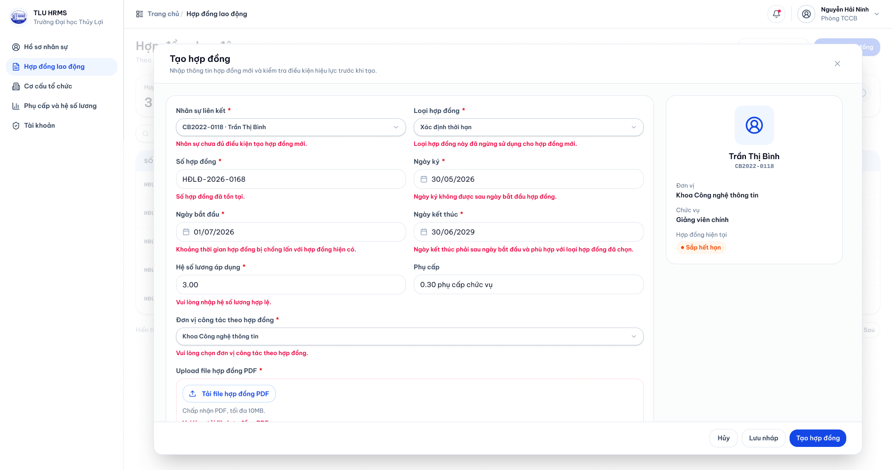

## 4.5. Kịch bản 5 - Gia hạn hợp đồng lao động

**Câu chuyện sử dụng:** Một số hợp đồng lao động sắp hết hạn, chuyên viên Phòng TCCB cần gia hạn kịp thời để đảm bảo quá trình làm việc của nhân sự không bị gián đoạn. Thay vì tạo hợp đồng mới từ đầu, người dùng bắt đầu từ danh sách hợp đồng sắp hết hạn và sử dụng chức năng gia hạn.

Chuyên viên bấm vào cảnh báo hợp đồng sắp hết hạn hoặc chọn bộ lọc trạng thái **Sắp hết hạn**. Hệ thống chỉ hiển thị những hợp đồng cần xử lý và sắp xếp theo ngày hết hạn gần nhất để hỗ trợ ưu tiên công việc.

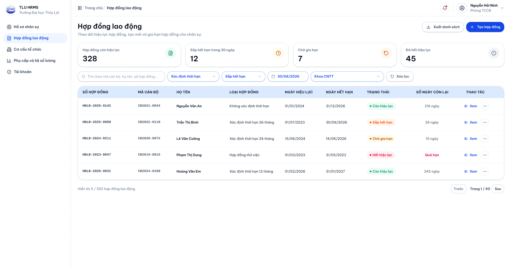

Từ danh sách đã lọc, chuyên viên chọn một hợp đồng và bấm **Gia hạn**. Hệ thống mở hộp thoại gia hạn, đồng thời đưa thông tin của hợp đồng cũ vào phần đầu hộp thoại để người dùng đối chiếu trước khi nhập dữ liệu mới.

Ở bước kiểm tra, hệ thống hiển thị loại hợp đồng hiện tại, ngày hết hạn, số lần đã ký và tình trạng đủ điều kiện gia hạn. Nếu hợp đồng không nằm trong khoảng thời gian được gia hạn hoặc đã đạt giới hạn số lần ký, nút xác nhận cần bị vô hiệu hóa và có thông báo lý do rõ ràng.

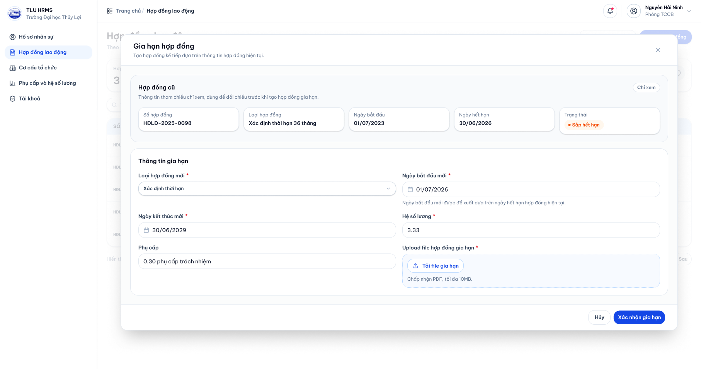

Khi hợp đồng đủ điều kiện, chuyên viên nhập thông tin gia hạn. Hệ thống có thể gợi ý ngày bắt đầu của hợp đồng mới ngay sau ngày kết thúc của hợp đồng cũ để hạn chế lỗi nhập liệu. Sau khi người dùng nhập ngày kết thúc, cập nhật mức lương hoặc đơn vị nếu có thay đổi, tải tệp hợp đồng và bấm **Xác nhận gia hạn**, hệ thống tạo hợp đồng mới và cập nhật lại danh sách hợp đồng sắp hết hạn.

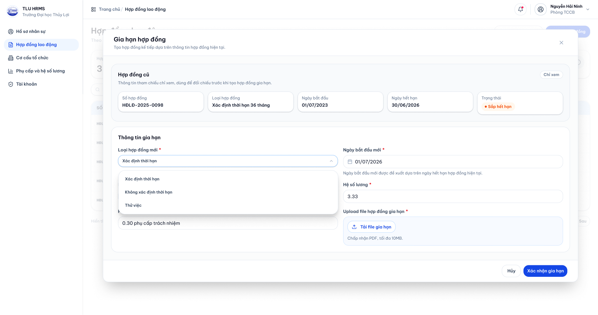

## 4.6. Nhận xét chung về storyboard

Các storyboard trên tập trung mô tả câu chuyện sử dụng theo trình tự thời gian: người dùng bắt đầu từ màn hình danh sách, thực hiện tìm kiếm hoặc mở hộp thoại nghiệp vụ, nhận phản hồi từ hệ thống, xử lý lỗi nếu có và kết thúc bằng trạng thái thành công. Mỗi hình phác họa được đặt tại một điểm quan trọng của kịch bản để nhóm thiết kế có thể chuyển thành các frame trong prototype, đồng thời vẫn hiểu được vì sao frame đó xuất hiện trong luồng thao tác.
